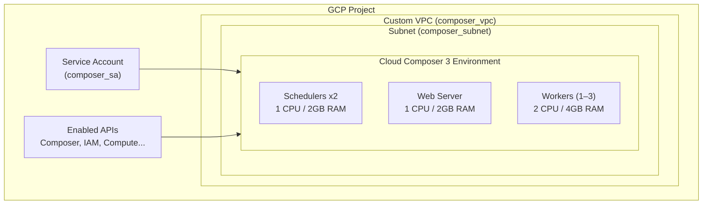

# Terraform Module: Cloud Composer 3

This module deploys a production-ready **Google Cloud Composer 3** (managed Apache Airflow 3) environment on GCP. It handles everything end-to-end: enabling required APIs, creating a dedicated VPC and subnet, provisioning a service account with least-privilege permissions, and standing up the Composer environment itself.

> **Target audience:** Engineers deploying or maintaining Airflow-based data pipelines on GCP.

---

## What This Module Creates

| Resource | Description |
|---|---|
| `google_composer_environment` | Composer 3 environment running Airflow 3 |
| `google_compute_network` | Dedicated VPC for the Composer environment |
| `google_compute_subnetwork` | Subnet within the VPC |
| `google_service_account` | Least-privilege SA attached to Composer nodes |
| GCP APIs | All required APIs enabled automatically |

---

## Architecture



The Composer environment runs inside a **private VPC** with a dedicated subnet, using a custom service account — nothing shares infrastructure with other GCP services in the project.

---

## Prerequisites

Before applying this module, make sure you have:

- [ ] **Terraform >= 1.3** installed (`terraform -version`)
- [ ] **`google-beta` provider** access — this module uses beta Composer features
- [ ] **GCP project** with billing enabled
- [ ] **Permissions** — your account needs at minimum:
  - `roles/composer.admin`
  - `roles/compute.networkAdmin`
  - `roles/iam.serviceAccountAdmin`
- [ ] **GCS bucket** for Terraform remote state (referenced in `backend.tf`)
- [ ] Authenticated via `gcloud auth application-default login`

---

## Usage

### Basic Example

```hcl
module "composer3" {
  source = "./modules/composer3"

  project_id       = "your-gcp-project-id"
  region           = "europe-west2"
  environment_name = "dev"
}
```

### With Custom Values (`terraform.tfvars`)

```hcl
project_id       = "my-data-platform-prod"
region           = "europe-west2"
environment_name = "production"
```

### Deploy Steps

```bash
# 1. Initialise (downloads providers, connects to remote state)
terraform init

# 2. Preview what will be created
terraform plan -var-file="terraform.tfvars"

# 3. Apply (Composer takes ~20–30 mins to provision)
terraform apply -var-file="terraform.tfvars"
```

> ⏱ **Note:** Cloud Composer environments typically take **20–30 minutes** to fully provision. This is expected — the GCP API handles the orchestration in the background.

---

## Installed Python Packages

The following PyPI packages are pre-installed in the Composer environment:

| Package | Version | Purpose |
|---|---|---|
| `pymssql` | 2.3.2 | SQL Server connectivity |
| `pandas` | 2.2.3 | Data manipulation |

To add more packages, update the `pypi_packages` block in `main.tf` and re-apply.

---

## Workload Sizing

| Component | CPU | Memory | Storage | Count |
|---|---|---|---|---|
| Scheduler | 1 | 2 GB | 5 GB | 2 |
| Web Server | 1 | 2 GB | 5 GB | 1 |
| Worker | 2 | 4 GB | 10 GB | 1–3 (autoscaled) |

Workers scale automatically between 1 and 3 based on DAG queue depth.

---

## Inputs

<!-- BEGIN_TF_DOCS -->

| Name | Description | Type | Default | Required |
|---|---|---|---|---|
| `project_id` | The GCP project ID | `string` | `"samrats-sandbox"` | no |
| `region` | The GCP region to deploy into | `string` | `"europe-west2"` | no |
| `environment_name` | The name of the Composer environment | `string` | `"dev"` | no |

<!-- END_TF_DOCS -->

---

## Outputs

> Run `terraform output` after apply to retrieve values.

<!-- Add outputs here once defined in outputs.tf -->

---

## File Structure

```
composer3/
├── main.tf            # Composer environment resource
├── networking.tf      # VPC and subnet
├── service_accounts.tf# IAM service account
├── apis.tf            # GCP API enablement
├── providers.tf       # google-beta provider config
├── backend.tf         # Remote state (GCS)
└── variables.tf       # Input variables
```

---

## Common Issues

**Composer environment stuck in `CREATING` state**
This is normal — wait up to 30 minutes. If it exceeds that, check the GCP Console under **Composer > Environments** for error details.

**API not enabled error on first apply**
The `apis.tf` enables required APIs, but GCP can take 1–2 minutes to propagate. Re-run `terraform apply` if you hit this on a brand new project.

**Permission denied on service account creation**
Ensure your account has `roles/iam.serviceAccountAdmin` in the target project.

---

## Maintainer

| Field | Value |
|---|---|
| Module | `composer3` |
| Environment | `sandbox → dev → prod` |
| GCP Region | `europe-west2` (London) |


## Requirements

| Name | Version |
|------|---------|
| <a name="requirement_terraform"></a> [terraform](#requirement\_terraform) | >= 1.5.0 |
| <a name="requirement_google"></a> [google](#requirement\_google) | ~> 6.0 |
| <a name="requirement_google-beta"></a> [google-beta](#requirement\_google-beta) | ~> 6.0 |

## Providers

| Name | Version |
|------|---------|
| <a name="provider_google"></a> [google](#provider\_google) | 6.50.0 |
| <a name="provider_google-beta"></a> [google-beta](#provider\_google-beta) | 6.50.0 |

## Modules

No modules.

## Resources

| Name | Type |
|------|------|
| [google-beta_google_composer_environment.composer3](https://registry.terraform.io/providers/hashicorp/google-beta/latest/docs/resources/google_composer_environment) | resource |
| [google_compute_network.composer_vpc](https://registry.terraform.io/providers/hashicorp/google/latest/docs/resources/compute_network) | resource |
| [google_compute_subnetwork.composer_subnet](https://registry.terraform.io/providers/hashicorp/google/latest/docs/resources/compute_subnetwork) | resource |
| [google_project_iam_member.composer_worker](https://registry.terraform.io/providers/hashicorp/google/latest/docs/resources/project_iam_member) | resource |
| [google_project_service.composer_api](https://registry.terraform.io/providers/hashicorp/google/latest/docs/resources/project_service) | resource |
| [google_project_service.compute_api](https://registry.terraform.io/providers/hashicorp/google/latest/docs/resources/project_service) | resource |
| [google_service_account.composer_sa](https://registry.terraform.io/providers/hashicorp/google/latest/docs/resources/service_account) | resource |

## Inputs

| Name | Description | Type | Default | Required |
|------|-------------|------|---------|:--------:|
| <a name="input_environment_name"></a> [environment\_name](#input\_environment\_name) | The name of the environment | `string` | `"dev"` | no |
| <a name="input_project_id"></a> [project\_id](#input\_project\_id) | The GCP project ID | `string` | `"samrats-sandbox"` | no |
| <a name="input_region"></a> [region](#input\_region) | The GCP region | `string` | `"europe-west2"` | no |

## Outputs

No outputs.
